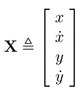
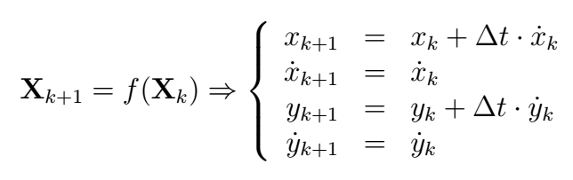
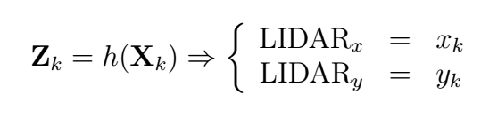
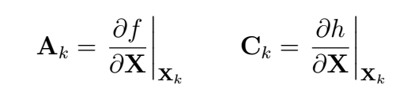

# ECE 6460 Homework #4

The purpose of this assignment is to become familiar with implementing an Extended Kalman Filter (EKF) by using one to process raw segmented objects coming from a 3D LIDAR scan. The goal is to track individual objects through time and infer their velocity relative to the vehicle.

## Due Date
This assignment is due on Sunday, November 17th at midnight.

## Provided Files
- `homework4.launch` which is already completely set up; no changes necessary
- `homework4_node.cpp`, `Homework4.cpp`, and `Homework4.hpp`, which makes a ROS node wrapper for the EKF that manages spawning new EKF instances and deleting obsolete instances for each object detected in the LIDAR scan
- `ObjectEkf.cpp` and `ObjectEkf.hpp`, which implement the core EKF class that will be responsible for tracking the position and velocity of individual objects.
- `Homework4.cfg`: Dynamic reconfigure configuration file with the default parameters already set to the proper values. It is encouraged to experiment with the parameter values to see how they affect the system though!

## Requirements
- Edit the provided `ObjectEkf.cpp` source file at each TODO comment to finish implementing the EKF algorithm. Use the hints in the next section about the state space model to write the required changes.

## EKF State Space Model
### State vector definition
Because we're interested in tracking both the position and velocity of the LIDAR objects, the EKF model has four states: the individual x and y components of position and velocity:

### Discrete state space model equations
The state dynamics of the EKF assume the object will move freely in both x and y. Therefore, the discrete state equation is:

The raw objects being input from the point cloud segmentation algorithm provide measurements of the x and y position, so the measurement equation for the state space model is:

### Process and measurement noise parameters
The dynamic reconfigure GUI parameters for the EKF algorithm are:

- `q_pos`: Standard deviation of the position states
- `q_vel`: Standard deviation of the velocity states
- `r_pos`: Standard deviation of the position measurements

The Q and R matrices of the EKF are populated with these parameters in the `setQ()` and `setR()` methods of the `ObjectEkf` class.

### State and measurement Jacobians
The A and C matrices that are used in the EKF algorithm are computed from the state and measurement equations, respectively:

## Testing Locally
After making the required changes, test your EKF implementation locally on your PC:

- Run `tests.bash` on your PC to automatically download the Homework 4 bag file into `devel/share/homework4/tests` in your ROS workspace folder. Alternatively, download the bag directly from here:
[http://www.secs.oakland.edu/~mtradovn/ece_6460/homework4.bag](http://www.secs.oakland.edu/~mtradovn/ece_6460/homework4.bag) 
- Run `homework4.launch` to start up the software and visualize the tracking outputs in Rviz and how they compare to the reference implementation
- Run the bag file manually on the command line to test your Homework 4 node
- Play around with the Kalman filter parameters to see how they affect the system.

## Automatic Test Procedure
The test script for Homework 4 verifies the following:

- Makes sure there are a non-zero number of EKF outputs
- Makes sure the 3D dimensions of the objects are present in the EKF outputs
- Checks the EKF outputs with the equivalent output from the reference implementation
	- Makes sure the estimated position matches the reference with some tolerance
	- Makes sure the estimated velocity matches the reference with some tolerarnce
